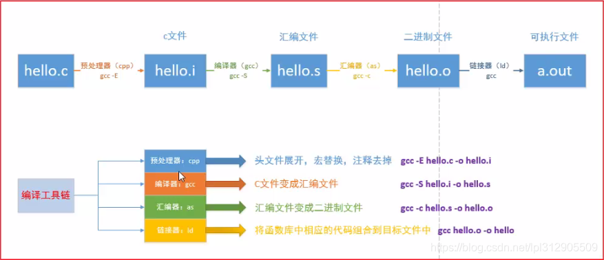

[TOC]

## 引人入题

有人说, linux下源码安装软件就是"三步走"

> ./configure
>
> make
>
> make install

真的是这样吗? 为什么?

## 目标

- 希望大家都能用上, 提高工作效率!
- 了解到周边的东西, 开阔视野!


## 一些前置知识

gcc编译的4个阶段(示例文件位于: **gcc-4-stages)**




### gcc命令的一些技巧

自动找出依赖:

```shell
# redis中的Makefile.dep用到了这个技巧
$ gcc -MM main.c 
main.o: main.c

$ gcc -M main.c 
main.o: main.c /usr/include/stdc-predef.h /usr/include/stdio.h \
 /usr/include/x86_64-linux-gnu/bits/libc-header-start.h \
 /usr/include/features.h /usr/include/x86_64-linux-gnu/sys/cdefs.h \
 /usr/include/x86_64-linux-gnu/bits/wordsize.h \
 /usr/include/x86_64-linux-gnu/bits/long-double.h \
 /usr/include/x86_64-linux-gnu/gnu/stubs.h \
 /usr/include/x86_64-linux-gnu/gnu/stubs-64.h \
 /usr/lib/gcc/x86_64-linux-gnu/8/include/stddef.h \
 /usr/lib/gcc/x86_64-linux-gnu/8/include/stdarg.h \
 /usr/include/x86_64-linux-gnu/bits/types.h \
 /usr/include/x86_64-linux-gnu/bits/typesizes.h \
 /usr/include/x86_64-linux-gnu/bits/types/__fpos_t.h \
 /usr/include/x86_64-linux-gnu/bits/types/__mbstate_t.h \
 /usr/include/x86_64-linux-gnu/bits/types/__fpos64_t.h \
 /usr/include/x86_64-linux-gnu/bits/types/__FILE.h \
 /usr/include/x86_64-linux-gnu/bits/types/FILE.h \
 /usr/include/x86_64-linux-gnu/bits/types/struct_FILE.h \
 /usr/include/x86_64-linux-gnu/bits/stdio_lim.h \
 /usr/include/x86_64-linux-gnu/bits/sys_errlist.h
```


## 一些内置变量/特殊写法/命令选项

**命令开始的空白应该是tab, 而不是空格!!!**

**$@**  是目标

**$<**  是第一个源

**$^** 是所有的源，因此当只有一个源的时候，和`$<`是相等的

```shell
special-chars-target: spe1 spe2
	@echo "\$$@:" $@
	@echo "\$$^:" $^
	@echo "\$$<:" $<

spe1:
	@echo "spe1 target"

spe2:
	@echo "spe2 target"

# 执行测试
# $ make special-chars-target
# spe1 target
# spe2 target
# $@: special-chars-target
# $^: spe1 spe2
# $<: spe1
```


**@command** 这种写法表示不显示执行的命令

**-command** 这种写法表示不管命令出不出错都认为是成功(**退出码为0**)的

**-n / --just-print** 如果 make 执行时，带入 make 参数“-n”或“--just-print”，那么其只是显示命令，
但不会执行命令，这个功能很有利于我们调试我们的 Makefile，看看我们书写的命令是执
行起来是什么样子的或是什么顺序的。

**-s / --silent** 全面禁止命令的显示。 

**CC**  默认为`gcc`

**RM ** 默认为`rm -f`


## 使用变量

### = 延迟求值

```makefile
# 演示使用变量之 =
Options = -l $(Options_part)
Options_part = -i -a
var:
	@echo $(Options)
	@ls $(Options) /etc | head -5

```


### := 即时求值

```makefile
# 演示使用变量之 :=
Options2 := -l $(Options2_part)
Options2_part = -i -a
var2:
	@echo $(Options2)
	@ls $(Options2) /etc | head -5

```


### ?= 设置默认值

```makefile
# 演示使用变量之 ?=
#PREFIX = /opt/soft
PREFIX ?= /usr/local
default-value:
	echo $(PREFIX)

```


### += 追加

```makefile
# 追加 +=
append_value = a b
append_value += c d
append-target:
	@echo $(append_value)

```


## 使用条件判断

`ifeq`, `ifneq`, `ifdef`, `ifndef`


## 使用函数

- `$(subst <from>,<to>,<text>) `

  普通替换

    ```makefile
  # 把“feet on the street”中的“ee”替换成“EE”，返回结果是“fEEt on the strEEt”。 
$(subst ee,EE,feet on the street)
    ```
  
- `$(patsubst <pattern>,<replacement>,<text>) `

  模式替换

    ```makefile
  # 把字串“x.c.c bar.c”符合模式[%.c]的单词替换成[%.o]，返回结果是“x.c.o bar.o” 
  $(patsubst %.c,%.o,x.c.c bar.c) 
    ```

- `$(strip <string>) `

  有的语言也叫`trim()`

  ```makefile
  $(strip a b c ) 
  把字串“a b c ”去到开头和结尾的空格，结果是“a b c”。
  ```

- $(shell command)

  shell 函数把执行操作系统命令后的输出作为函数返回

  ```makefile
  contents := $(shell cat /etc/passwd) 
  ```

- `$(error <text ...>) `, `$(warning <text ...>)`

  `error()`会产生致命错误,致使make退出. 而`warning()`只是输出警告.

  调试输出

  ```makefile
  error-target:
  	$(error "fatal error...")
  	echo "the end"
  
  warning-target:
  	$(warning "warning msg...")
  	@echo "continue"
  ```


## 模式规则

查看目录`pattern-demo`来说明

> 模式规则中，至少在规则的目标定义中要包含"%"，否则，就是一般的规则。目标中的
> "%"定义表示对文件名的匹配，"%"表示长度任意的非空字符串。例如："%.c"表示以".c"结
> 尾的文件名（文件名的长度至少为 3），而"s.%.c"则表示以"s."开头，".c"结尾的文件名（文
> 件名的长度至少为 5）。 

```shell
%.css: %.less
	$(LESSC) $< $@
```

上面的例子表示: 将所有的`.less`文件, 使用[lessc](http://lesscss.org/#)命令转换为`.css`文件


## 伪目标

一个"假"的目标, 不是一个真实的文件

```makefile
.PHONY: clean
clean:
	rm -f *.tmp
```


## 周边

- [maven](x) **/ˈmeɪvn/ 专家; 内行;**   pom.xml

  > Apache Maven is a software project management and comprehension tool.

- [ant](https://ant.apache.org/)  build.xml

  > Apache Ant is a Java library and command-line tool whose mission is to drive processes described in build files as targets and extension points dependent upon each other. 

- [cmake](https://cmake.org/) CmakeLists.txt

  >  CMake is an open-source, cross-platform family of tools designed to build, test and package software.

- [gulp](https://www.gulpjs.com.cn/) gulpfile.js

  > gulp 将开发流程中让人痛苦或耗时的任务自动化，从而减少你所浪费的时间、创造更大价值。

- [webpack](https://webpack.js.org/concepts/) weback.config.js

  >  **webpack** is a *static module bundler* for modern JavaScript applications.

**More...**


## 参考

- [The Four Stages of Compiling a C Program](https://www.calleerlandsson.com/the-four-stages-of-compiling-a-c-program/#:~:text=At an overview level%2C the,compilation%2C assembly%2C and linking.)
- 《跟我一起写Makefile-陈皓》